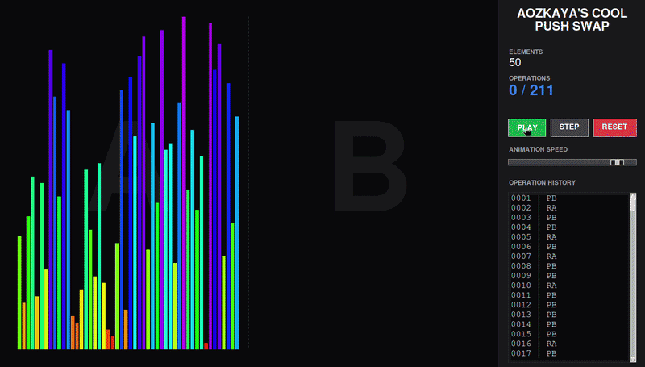

# Push_Swap



*This project has been created as part of the 42 curriculum by aozkaya.*

## Description
The Push_swap project is a highly effective algorithmic challenge aimed at sorting data. You have at your disposal a set of integer values, two stacks (Stack A and Stack B), and a specific set of instructions to manipulate both stacks. The goal is to write a C program called `push_swap` which calculates and outputs the shortest possible sequence of instructions needed to sort the given integers in ascending order. This project dives deep into sorting algorithms and the concept of time complexity.

## Instructions
**Compilation:**
To compile the project, run the following command at the root of the repository:
```bash
make
```
This will compile the `push_swap` executable.
To compile the bonus checker program, run:
```bash
make bonus
```

**Execution:**
You can run the `push_swap` program by providing it with a list of integers formatted as arguments:
```bash
./push_swap 4 67 3 87 23
```
This will print out the sequence of operations required to sort the stack.

You can verify the result using the bonus `checker`:
```bash
ARG="4 67 3 87 23"; ./push_swap $ARG | ./checker $ARG
```
If the operations sort the list successfully, the checker will output `OK`.

## Resources
- [Sorting Algorithms Complexity](https://en.wikipedia.org/wiki/Sorting_algorithm)
- Push_Swap Visualizers online.

## AI Usage
AI was used purely as a learning tool to better understand theoretical concepts, such as time complexity (Big O notation), how different sorting algorithms operate under the hood, and best practices for memory management in C. No code or debugging solutions were generated by AI.
